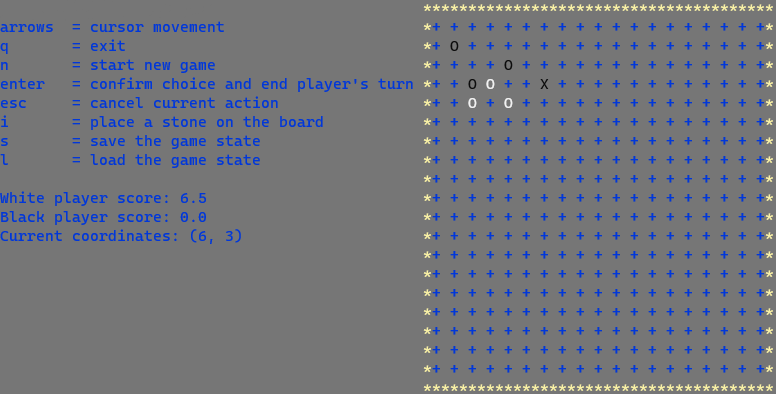

# GO - C++
## [Go game](https://en.wikipedia.org/wiki/Go_(game)) implementantion in C++ using console

This is a project I did during my first term of informatics studies on Gdańsk University of Technology.

It implements basics of the Go game.

